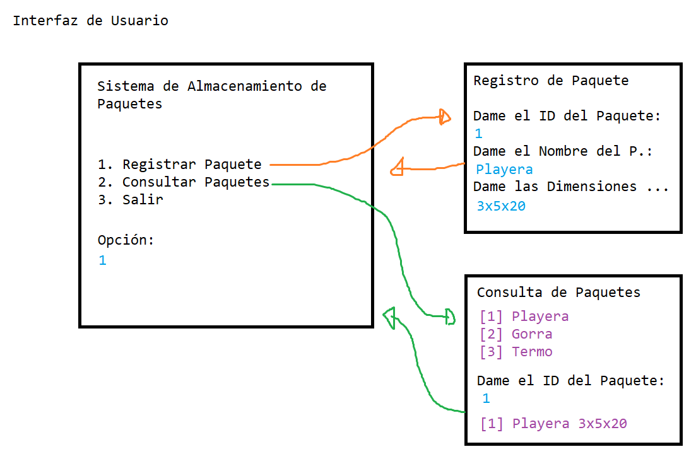
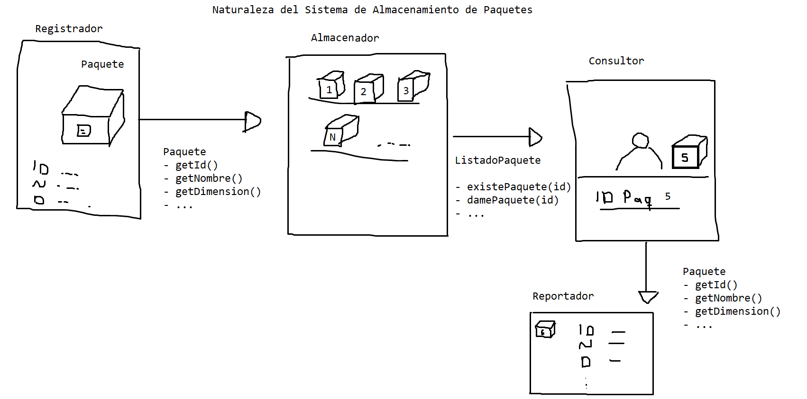
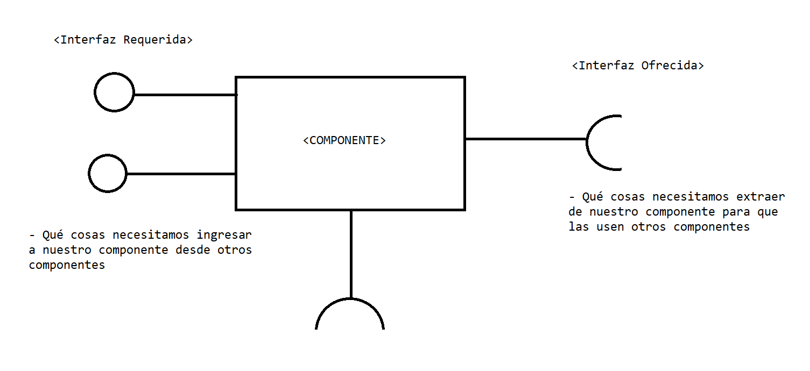
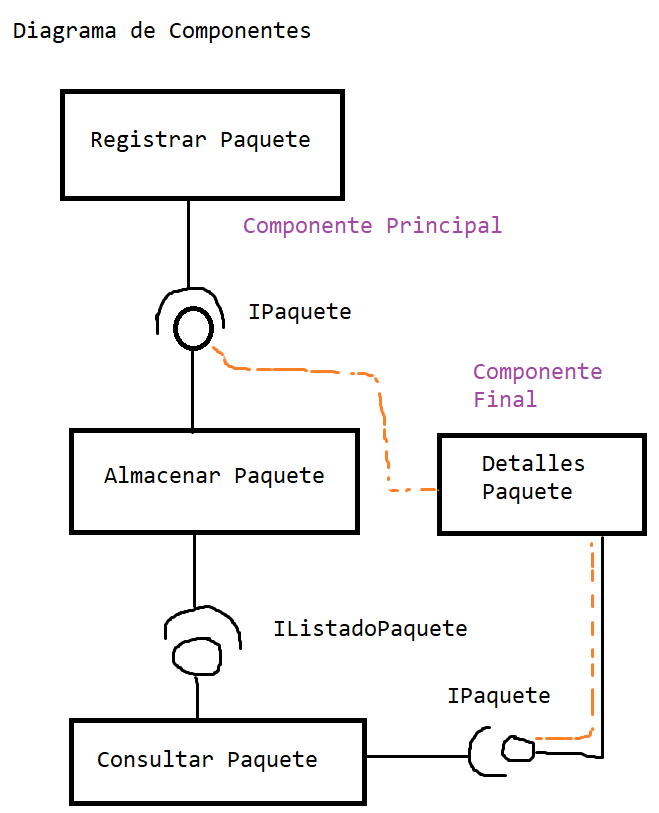
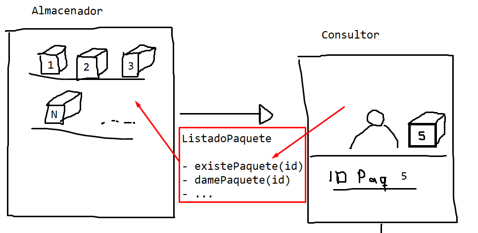
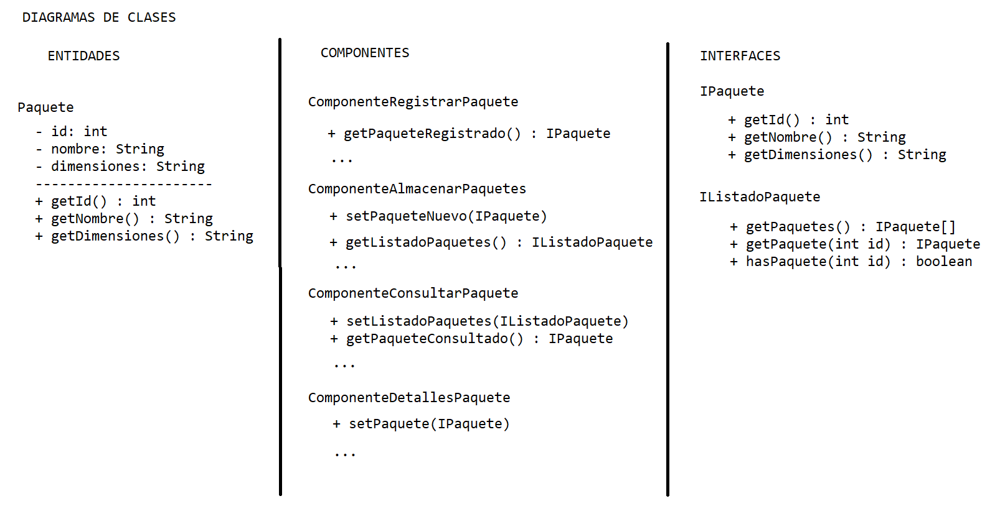

# Proyecto 1

## Introducción

En este proyecto realizaremos un **sistema de almacenamiento de paquetes** básico, 
que consistirá en definir diversas clases, interfaces y componentes para lograr el objetivo
de poder capturar los datos de un paquete, almacenarlos (en memoria) y poder consultarlos
posteriormente.

Comenzaremos estableciendo los componentes del sistema, detectando a este nivel las
interfaces que ofrece cada componente y las interfaces que requieren también.

Posteriormente generar clases que definan las implementaciones de las interfaces,
las entidades en el sistema y los componentes.

Finalmente proveeremos una comunicación entre los componentes utilizando una interfaz de usuario
en modo texto para proveer un menú similar al siguiente:

    Sistema de Paquetes
    1. Registrar un paquete
    2. Consultar un paquete
    3. Salir

    Registro de paquetes
    > Ingresa el identificador del paquete
    > Ingresa el nombre del paquete
    > Ingresa las dimensiones del paquete
    
    Consulta de paquetes
    [Se muestra la lista de paquetes almacenados]
    > Ingresa el identificador paquete a consultar
    [Se muestra la descripción extendida del paquete]

## Paso 1. Pensar en la naturaleza de las Interfaces de Usuario

Las interfaces de usuario son las pantallas gráficas o de texto con
el usuario está interactuando. 

    Con las interfaces de usuario podemos guiarnos
    para detectar los componentes del sistema

Sin embargo, no será directo, que una una interfaz de usuario se
convierta forzosamente en un componente del sistema. Es decir,
podrían existir componentes intermedios del sistema, que necesitemos
para poder conectar las interfaces de usuario.

> Ejemplo de la interfaz de usuario para el sistema de almacenamiento de paquetes

> Ejemplo de la naturaleza de las interfaces de usuario en analogía

## Paso 2. Modelar los componentes del sistema mediante Diagramas de Componentes

Los **Diagramas de Componentes** nos permiten abstraer piezas del sistema
que se pueden comunicar con otras piezas del sistema. Mediante
**Interfaces Requeridas** (modelos que le ingresen datos **hacía al componente**)
e **Interfaces Ofrecidas** (modelos que le extraigan datos **desde el componente**).

> Ejemplo de un componente genérico que determina que requiere y que ofrece

Debemos pensar en conjuntos de operaciones específicas para determinar los componentes
que absorban esas operaciones. Por ejemplo, un componente para registrar un paquete,
un componente para almacenar paquetes, un componente para consultar un paquete,
un componente para ver los detalles de un paquete, etc.

> Ejemplo del Diagrama de Componentes para el Sistema de Almacenamiento de Paquetes

Debemos tener claro siempre, que entre dos componentes se está diseñando una interfaz
requerida y ofrecida, que concuerdan entre lo que un componente requiere y un componente ofrece.

## Paso 3. Modelar las clases (entidades y componentes) e interfaces mediante Diagramas de Clases

Un **Diagrama de Clase** describe los atributos y métodos (para las clases) o 
solo los métodos (para las interfaces) y nos permite tener una definición limpia (sin código)
de las clases e interfaces usadas en nuestro sistema. Esta documentación permitirá reconstruir el sistema
cada vez que se desee.

> Ejemplo del Diagrama de Clases para el Sistema de Almacenamiento de Paquetes

