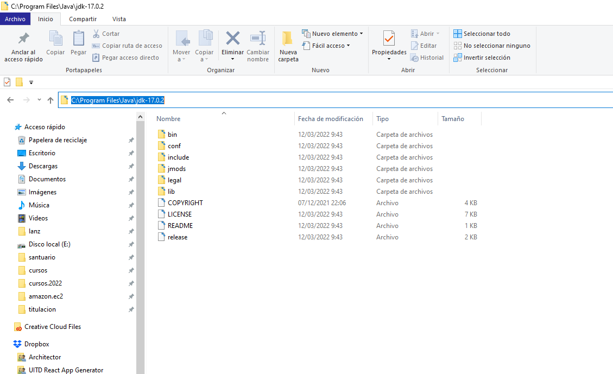
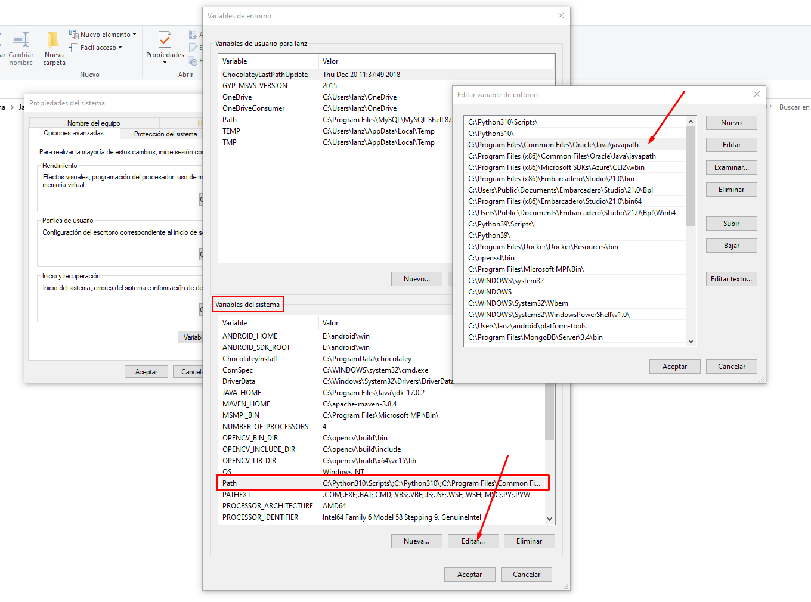

# Fundamentos de Java

[](https://cloud-systems-technology.com.mx)

---

## Programación Orientada a Objetos

El poder instruir a máquinas para cumplir objetivos, implica la implementación de algoritmos y pseudocódigos en lenguajes formales, para que la máquina entienda e interprete correctamente los pasos y procesos que necesita realizar para cumplir dichos objetivos. Esto es conocido como **la programación de la máquina**.

Según el tipo de máquinas, como computadoras por ejemplo, suelen disponer de múltiples lenguajes de programación de propósito general y también de propósito específico. En la modernidad se utilizan más los **lenguajes de programación de propósito general**. Ya que estos nos permiten resolver una gran cantidad de problemas, utilizando el mismo lenguaje.

Los **paradigmas de programación**, se refieren a la perspectiva y sentido que se le da al código generado y la forma en la que se modelan los problemas.

En la siguiente tabla podemos comparar los dos principales paradigmas de programación.

Paradigma | Modelo principal | Descripción
--- | --- | ---
Funcional | *Función o Proceso* | Establece que todos los problemas deberían ser resueltos mediante tareas programadas en funciones o procesos, que reciban una entrada y devuelvan una salida.
Orientado a Objetos | *Clases y Objetos* | Establece que todos los problemas deberían ser resueltos mediante entidades que absorban un estado interno y un las tareas posibles sobre estado (el objeto), con un diseño que permita entender la arquitectura de cada entidad (la clase).

Existen otros paradigmas, como los orientados a aspectos, orientados a eventos, programación modular, programación distribuída, etc. Pero principalmente se suelen utilizar los listados en la mayoría de lenguajes de programación de propósito general. Incluso algunos lenguajes soportan múltiples paradigmas de programación.

### Objetos

Los **objetos** son la pieza fundamental de la *programación orientada a objetos*. Estos **representan el conjunto de datos retenidos en el programa para una entidad en particular** (el estado de datos particular de una entidad). Dichos datos son aislados del resto de datos del programa y se consideran el estado de una entidad específica.

    Los objetos se componen de *atributos* y *métodos* que pueden ser accesibles desde dentro del objeto o desde fuera, según los niveles de acceso diseñados.

Pensemos por ejemplo, en un programa que está manipulando datos de personas. La entidad en cuestión será la `Persona`. Cada persona podrá retener datos que le describan, por ejemplo, el `nombre`, la `edad`, su `correo`, etc. A estos datos les llamaremos *los atributos de la entidad*. Sin embargo, la referencia física y lógica hacia los datos de una persona en particular, le llamaremos *el objeto de una Persona* o en términos informáticos *la instancia de una Persona*.

El objeto será la referencia a los datos de la entidad `Persona`, por ejemplo, el objeto `p1` se podría referir a los datos retenidos en el programa para una `Persona`, el objeto `p2` sería la referencia a los datos de otra `Persona` y así podríamos generar tantos objetos como deseemos, para retener cada conjunto de datos, para cada persona en particular. Si retuvieramos en memoria los datos de `1,000` personas, entonces necesitaríamos `1,000` objetos, cada uno reteniendo los datos de una persona en particular (su propio nombre, edad, correo, etc).

### Clases

Si vemos a los *objetos* como almacenes de datos de una entidad en particular, podríamos ver a las **clases** como el **diseño de una entidad en general**. Es decir, como el diseñador de cómo deberían generarse objetos de una entidad en general.

    Las clases nos permitirán modelar los objetos que serán construídos a través de dos tipos *miembros* que tendrá cada objeto. 
    
    Los *atributos* definirán los datos que conformarán cada objeto.

    Los *métodos* definirán las funciones que se podrán aplicar sobre cada objeto, para obtener, ajustar o procesar los atributos del objeto.

Se podría decir que la clase es el diseñador y el objeto es la construcción basada en el diseño. 

Por ejemplo, la clase de diseño puede determinar modelar objetos que sean moldeadoras de tornillos. Cada moldeadora de tornillos generará un tornillo específico. Entonces, la clase de diseño podría determinar las pulgadas de ancho de la cabeza (`anchoCabeza`), las pulgadas de ancho del cuerpo (`anchoCuerpo`), el lago de la cabeza (`lagoCabeza`), el largo del cuerpo (`largoCuerpo`), el número de ranuras por pulga que tendrá el cuerpo (`numRanuras`) y tipo de cabeza (`tipoCabeza`).

En la siguiente tabla se resumen los atributos para una clase (o entidad) capaz de moldear tornillos, llamada `MaquinaMoldeadoraTornillos`.

> Clase `MaquinaMoldeadoraTornillos` (Atributos)

Atributo | Tipo de Dato | Ejemplo | Descripción
--- | --- | --- | ---
`anchoCabeza` | Decimal | `1.5` | Ancho que tendrá la cabeza del tornillo
`anchoCuerpo` | Decimal | `0.5` | Ancho que tendrá el cuerpo del tornillo
`lagoCabeza` | Decimal | `0.1` | Largo que tendrá la cabeza del tornillo
`largoCuerpo` | Decimal | `0.8` | Largo que tendrá el cuerpo del tornillo
`numRanuras` | Entero | `16` | Número de vueltas que tendrá caben en una pulgada en el cuerpo del tornillo 
`tipoCabeza` | Texto | `Hexagonal` | Tipo de cabeza del tornillo, asociado a la llave utilizada para atornillarlo

La clase nos ayudará a mantener un modelo sólido sobre los datos retenidos por la entidad (**atributos**), para poder construir objetos específicos que retengan dichos datos. Sin embargo, también nos permitirá modelar las operaciones que podremos realizar sobre cada objeto particular, como recuperar los datos (`getters`), ajustar los datos (`setters`) o realizar operaciones en general (**métodos**).

Veamos algunos *métodos* que podríamos establecer sobre nuestra clase `MaquinaMoldeadoraTornillos`.

Ya sabemos que podemos diseñar máquinas para moldear tornillos. Existirán tantas máquinas posibles, como objetos con valores particulares creemos. Sin embargo, cada objeto (máquina moldeadora de tornillos en particular) podrá disponer de múltiples acciones (métodos) que se podrán aplicar sobre sus datos (atributos).

En la siguiente tabla se muestran algunos métodos aplicables a cada objeto definidos desde el diseño de la clase.

> Clase `MaquinaMoldeadoraTornillos` (Métodos)

Método | Parámetros de Entrada | Tipo de Salida | Aspecto | Descripción
--- | --- | --- | --- | ---
`obtnerAnchoCabeza` | - | Decimal | `Getter` | Devuelve el tamaño del ancho de la cabeza del tornillo
`obtnerAnchoCuerpo` | - | Decimal | `Getter` | Devuelve el tamaño del ancho del cuerpo del tornillo
`obtnerLagoCabeza` | - | Decimal | `Getter` | Devuelve el tamaño del largo de la cabeza del tornillo
`obtnerLargoCuerpo` | - | Decimal | `Getter` | Devuelve el tamaño del largo del cuerpo del tornillo
`obtnerNumRanuras` | - | Entero | `Getter` | Devuelve el número de ranuras que caben en una pulgada en el cuerpo del tornillo
`obtnerTipoCabeza` | - | Texto | `Getter` | Devuelve el tipo de cabeza del tornillo
`ajustarAnchoCabeza` | `anchoCabeza` | - | `Setter` | Ajusta el nuevo valor al dado mediante `anchoCabeza`
`ajustarAnchoCuerpo` | `anchoCuerpo` | - | `Setter` | Ajusta el nuevo valor al dado mediante `anchoCuerpo`
`ajustarLagoCabeza` | `largoCabeza` | - | `Setter` | Ajusta el nuevo valor al dado mediante `largoCabeza`
`ajustarLargoCuerpo` | `largoCuerpo` | - | `Setter` | Ajusta el nuevo valor al dado mediante `largoCuerpo`
`ajustarNumRanuras` | `numRanuras` | - | `Setter` | Ajusta el nuevo valor al dado mediante `numRanuras`
`ajustarTipoCabeza` | `tipoCabeza` | - | `Setter` | Ajusta el nuevo valor al dado mediante `tipoCabeza`
`describirMáquina` | - | Texto | `Descriptor` | Devuelve un texto que describe la máquina moldeadora de tornillos
`producirTornillos` | `numTornillos` | - | `Function` | Produce tantos tornillos como los específicados en la entrada `numTornillos`.

Podemos ver que los métodos contienen diferentes aspectos, por ejemplo, ser `Getter` (adquisitores de datos de los atributos del objeto), ser `Setter` (ajustadores de datos a los atributos del objeto), ser `Descriptor` (descriptores del objeto) o ser `Function` (funciones generales sobre el objeto).

Cada aspecto es una forma humana de entender los métodos en cuestión, pero en fines prácticos esto no es relevante. Basta con saber cuáles son los parámetros de entrada que necesita el método para funcionar sobre el objeto y el tipo de salida esperada.

Por ejemplo, los métodos tipo `getter` se centran en devolvernos la información sobre los datos retenidos en los atributos del objeto, los métodos tipo `setter` nos permiten actualizar los datos de los atributos del objeto, los métodos tipo `descriptor` nos permiten describir en forma compacta el objeto (podría ser Texto o Bytes para mostrarle la información del objeto al humano o serializarla para un archivo). Finalmente los métodos de tipo `Function` serán funciones generales, que podrán o no acceder a los atributos del objeto, modificándolos o no. Estos sirven en general para procesar los datos del objeto en formas personalizadas. 

En nuestro ejemplo el método `producirTornillos` podría comenzar a producir tornillos a una máquina real. Entonces, cada objeto que mande a llamar a dicho método hará el procesamiento necesario para conseguirlo.

### Atributo

Los **atributos** son especificaciones sobre los datos que podrán ser retenidos en cada objeto. La clase utiliza la especificación de cada atributo para permitirle al objeto en particular, retener esos datos en forma de variables. El atributo también especifica el nivel de acceso que tendrá el objeto desde afuera y desde clases derivadas, como veremos en temas posteriores de encapsulamiento, polimorfismo y herencia.

### Método

Los **métodos** son especificaciones sobre procesos que pueden ser aplicados al objeto (en forma de funciones). Estos se implementan como funciones que reciben parámetros de entrada devuelven una salida (opcionalmente ya que se puede usar `void` para especificar que el método no devuelve nada). Los métodos pueden verse como funciones con acceso a los atributos y otros métodos del objeto. Por lo que podemos crear componentes ricos en relaciones y procesamiento de tareas y rutinas.

Por ejemplo, un objeto capaz de retener los datos de una persona (atributos de la persona) y realizar diversas acciones u operaciones con esos datos (métodos de la persona). Así la persona podría tener un correo electrónico en sus datos (atributo `correo`) y la capacidad de enviarle un correo de saludo (método `enviarSaludoPorCorreo(mensaje) -> Booleano`), dónde en este último método, podemos definir qué tipo de parámetros necesitara el objeto desde afuera para funcionar (`mensaje` de tipo `Texto` con el contenido del saludo) y qué tipo de respuesta nos devolverá (un `Booleano`, que será un `true` o `false` si pudo lograr enviar el mensaje).

#### Ejercicio 3.1

* Responde las siguientes preguntas con tus propias palabras (no usar definiciones de libros, internet o estas mismas notas).
    - ¿Qué es una clase?
    - ¿Qué es un objeto?
    - ¿Qué es un atributo?
    - ¿Qué es un método?
    - ¿Cuál es la diferencia entre una clase y un objeto?
    - ¿Cuál es el límite de objetos permitidos por una clase?
    - ¿Cuál es el límite de atributos permitidos por una clase?
    - ¿Cuál es el límite de métodos permitidos por una clase?
    - ¿Qué diferencia hay entre el atributo de una clase y el atributo en un objeto?
    - ¿Qué diferencia hay entre el método de una clase y el atributo en un objeto?
    - ¿Para qué serviría una clase que no tenga métodos definidos?
    - ¿Para qué serviría una clase que no tenga atributos definidos?
* Modela tres clases distintas con sus atributos y métodos como en las tablas anteriores.

## Diagramas de Clases

Los **Diagramas de Clases** nos permiten modelar clases y las relaciones entre otras clases y objetos de forma esquemática. Estos consisten en una serie de símbolos estandarizados para definir correctamente los atributos y nivel de acceso, los métodos con sus parámetros de entrada, la salida esperada y su nivel de acceso. También algunas relaciones de herencia y dependencia de objetos.

En la siguiente figura podemos ver un resumen de estos símbolos para los **Diagramas de Clases UML** (`UML` - Lenguaje de Modelado Unificado).

> Figura 3.1 - Modelado de clases


Una clase es modelada como una caja dividida en tres secciones, la primer sección contendrá el nombre de la clase (relacionada a la entidad). La segunda sección describirá una lista de todos los atributos de la clase con el formato `<acceso> <nombre> : <tipo>`, dónde el tipo de dato es algo opcional, pero que lo vuelve más descriptivo. Finalmente en la tercer sección se listarán todos los métodos (o acciones / operaciones) determinadas por la clase sobre los objetos.

> EJEMPLO: Clase MaquinaMoldeadoraTornillos

    +----------------------------------------------------+
    | MaquinaMoldeadoraTornillos                         |
    +----------------------------------------------------+
    | [-] anchoCabeza : Decimal                          |
    | [-] anchoCuerpo : Decimal                          |
    | [-] lagoCabeza  : Decimal                          |
    | [-] largoCuerpo : Decimal                          |
    | [#] numRanuras  : Entero                           |
    | [+] tipoCabeza  : Texto                            |
    +----------------------------------------------------+
    | [+] obtnerAnchoCabeza  : () -> Decimal             |
    | [+] obtnerAnchoCuerpo  : () -> Decimal             |
    | [+] obtnerLagoCabeza   : () -> Decimal             |
    | [+] obtnerLargoCuerpo  : () -> Decimal             |
    | [+] obtnerNumRanuras   : () -> Entero              |
    | [+] obtnerTipoCabeza   : () -> Texto               |
    | [-] ajustarAnchoCabeza : (anchoCabeza) -> *        |
    | [-] ajustarAnchoCuerpo : (anchoCuerpo) -> *        |
    | [-] ajustarLagoCabeza  : (lagoCabeza)  -> *        |
    | [-] ajustarLargoCuerpo : (largoCuerpo) -> *        |
    | [-] ajustarNumRanuras  : (numRanuras)  -> *        |
    | [-] ajustarTipoCabeza  : (tipoCabeza)  -> *        |
    | [+] describirMáquina   : () -> Texto               |
    | [#] producirTornillos  : (numTornillos) -> *       |
    +----------------------------------------------------+

En el diagrama podemos observar la presencia de `[+]`, `[-]` y `[#]` que son los niveles de acceso de los miembros a público, privado y protegido, respectivamente. Estos niveles de acceso se revisarán posteriormente, sin embargo, a grandes rasgos significan que dichos miembros (atributos o métodos) pueden ser accedidos desde fuera del objeto (es público), sólo desde adentro del objeto (es privado) o desde dentro del objeto o algún objeto derivado mediante herencia (está protegido).

> Figura 3.2 - Modelado de relaciones entre clases


Las clases se pueden relacionar mediante **Asociaciones**, que signfica que una clase está asociada a otra (flecha simple `-->`) o heredada (flecha con terminación en triángulo `-->>`). Este tipo de relación se conoce como asociación, ya que indica que una clase puede ser accedida desde otra clase, es decir, un objeto tendrá acceso a los miembros de otra clase, generalmente por herencia o implementación de interfaces o clases abstractas. La diferencia entre una asociación simple (`-->`) y una marcada (`-->>`) será el medio de acceso, que podría significar que desde una clase se accede a otra por relación de algún atributo (asociación simple) o por herencia (asociación marcada).

Otro tipo de relaciones entre las clases se da mediante la relación de **agregación** (flecha con terminación en rombo vacío `--<>`) que significa que la clase posee la referencia a un objeto de otra clase, es decir, la clase primaria (`A`), posee un objeto de la clase secundaria (`B`). Si se desea hacer una operación sobre el objeto de la clase secundaria (`B`) se podría lograr hacer desde la clase primaria (`A`). 

Por ejemplo, supongamos que existe la clase `Venta` y esta tiene la referencia a la clase `Vendedor` y la referencia a la clase `Cliente`, entonces podemos definir una relación de agregación sobre `Venta` hacía `Vendedor` y otra relación de agregación sobre `Venta` hacía `Cliente`. Ya que una venta contiene la referencia a un objeto de `Vendedor` y la referencia hacía algún objeto de `Cliente`.

> EJEMPLO: Relaciones de **Agregación** entre `Venta`, `Vendedor` y `Cliente`

    [Venta] ──<> [Vendedor]
        └─────<> [Cliente]

También existe otro tipo de relaciones entre clases llamada **composición** (flecha con terminación en rombo relleno `--<+>`), y se da cuando la clase primaria (`A`) es quién creó el objeto de la clase secundaria (`B`), es decir, es el único con la referencia al objeto de la otra clase.

Por ejemplo, cuándo una clase llamda `Paquete` genera un objeto llamado `Acuse` y otro objeto llamado `Guia`, los cuales servirán para enviar el paquete. Entonces, estas relaciones serán de *composición* ya que los objetos serán administrados por la clase `Paquete`, es decir, todo lo que les ocurra al `Acuse` y la `Guia` será a través de `Paquete`. Un objeto `Acuse` no existirá fuera de un `Paquete`, tampoco un objeto `Guia`.

> EJEMPLO: Relaciones de **Composición** entre `Paquete`, `Acuse` y `Guia`

    [Paquete] ──<+> [Acuse]
        └───────<+> [Guia]

Con estos diagramas podemos modelar clases, las relaciones entre las clases y las relaciones entre sus objetos.

### Ejercicio 3.2

* Responde las siguientes preguntas con tus propias palabras (no usar definiciones de libros, internet o estas mismas notas).
    - ¿Qué diferencia hay entre las relaciones de asociación y las relaciones de agregación y composición?
    - En una relación de agregación entre la clase primaria y la clase secundaria, ¿Puede existir un objeto de la clase secundaria fuera de la clase primaria?
    - En una relación de composición entre la clase primaria y la clase secundaria, ¿Puede existir un objeto de la clase secundaria fuera de la clase primaria?
* Crea los diagramas de clases para un sistema de ventas considerando los siguientes puntos y procesos.
    - Una venta se refiere a un evento en el cuál hay un monto total vendido, una lista de productos asociados, un acuse para abrir la venta por parte de un vendedor, un acuse para confirmar la venta por parte de un cliente, un acuse para cerrar la venta por parte de un vendedor, un acuse para recibir los productos de la venta por parte de un servicio de entrega, un acuse para confirmar la recepción de los productos entregados por parte de un cliente, un acuse para confirmar la entrega por parte de un vendedor, un acuse para completar la venta por parte del sistema y una guia de transporte para entregar los productos de la venta al servicio de entrega.
    - El vendedor se refiere a un empleado físico o virtual (punto de venta) capaz de firmar los acuses que se le soliciten.
    - El cliente se refiere a un cliente físico o virtual (plataforma de venta) capaz de firmar los acuses que se le soliciten.
    - El servicio de entrega se refiere a una empresa física o virtual (paquetería) capaz de recibir una guía de venta y firmar los acuses que se le soliciten.

## Diagramas de Componentes

Los **Diagramas Componentes** permiten modelar el funcionamiento del sistema a través de procesos y transferencia de datos entre las entidades (generalmente clases).

El componente lo entenderemos como un objeto capaz de entregar datos (`interfaz de oferta`) y capaz de recibir datos (`interfaz de requerimiento`). En estas notas no manejaremos símbolos adicionales como paquetes y demás, a menos que haga falta, y en su momento se explicarán más a detalle.

En la siguiente figura podemos ver los diferentes símbolos que componenen un diagrama de componentes.

> Figura 3.3 - Símbolos de los diagramas de componentes


Los símbolos que utilizaremos son el de **Componente**, el de **Interfaz ofrecida**, la **Interfaz requerida** y el **Puerto**. Los demás símbolos no serán utilizados en estas notas.

El **Componente** representará el objeto que interactua en el sistema.

La **Interfaz ofrecida** será la comunicación o relación de los datos que saldrán del componente y se conectarán hacía otro componente.

La **Interfaz requerida** será la comunicación o relación de los datos que entrarán al componente y desde otro componente.

El **Puerto** será la forma en la que se determinará una salida o entrada de datos.

En la siguiente figura podemos ver un ejemplo de un diagrama de componentes para un sistema de correo electrónico.

> Figura 3.4 - Ejemplo de un diagrama de componentes para un sistema de correo electrónico


Cómo podemos observar en el diagrama existen tres componentes.

1. El administrador del correo
2. Los correos en la bandeja de entrada
3. Los correos en la bandeja de salida

Para entender los diagramas de componentes, es importante ejercitar leerlos describiendo las relaciones de oferta y requerimiento entre los componentes. Veamos la explicación leída del ejemplo.

    El [Sistema de Correo] requiere recolectar los datos del correo electrónico que estará administrando, estos datos podrían ser, el correo, la contraseña, el protocolo de mensajería, el nombre del usuario, etc. 
    
    El componente [Sistema de Correo] ofrecerá los datos sobre el correo, para poder obtener la lista de correos en la bandeja de entrada y la lista de correos en la bandeja de salida.

    El componente [Bandeja de Entrada] requiere los datos de correo, y quizás datos que permitan filtrar los correos por fecha o búsquedas específicas, esta comunicación permitirá conectar la bandeja de entrada con el sistema de administración de correo y devolverle la lista de correo en la bandeja de entrada.

    El componente [Bandeja de Salida] requiere los datos de correo, y quizás datos que permitan filtrar los correos por fecha o búsquedas específicas, esta comunicación permitirá conectar la bandeja de salida con el sistema de administración de correo y devolverle la lista de correo en la bandeja de salida.

Como podemos observar, la descripción de los tres componentes, permite establecer las relaciones entre los componentes y entender los requerimientos de datos del componente (`Interfaz requerida`) y los datos que ofrece el componente (`Interfaz ofracida`).

De esta manera podremos modelar la trasacción de datos entre componentes y determinar si se podrían reemplazar algunos componentes por otros, sin tener una pérdida de datos y generalidad.

### Ejercicio 3.3

* Responde las siguientes preguntas con tus propias palabras (no usar definiciones de libros, internet o estas mismas notas).
    - ¿Que representa un `Componente`?
    - ¿Que representa una `Interfaz Requerida`?
    - ¿Que representa una `Interfaz Ofrecida`?
    - ¿Es posible reemplazar un componente por otro y qué necesitaríamos?
    - ¿Importa de donde vienen los datos de la `Interfaz ofrecida`?
    - ¿Importa hacía donde van los datos de la `Interfaz requerida`?
* Diseña el diagrama de componentes para el sistema de ventas propuesto en la sección anterior.

## Instalación de Java JDK

> Figura 4.1 - Página de descarga de Java


[https://www.oracle.com/java/technologies/downloads/](https://www.oracle.com/java/technologies/downloads/)

> Figura 4.2 - Instalación

    NOTA: Copiar la ruta donde será instalado el JDK

    >>> C:\Program Files\Java\jdk-17.0.2


### Configuración de Java JDK

> Figura 4.3 - Ubicamos la carpeta del JDK



> Figura 4.4 - Abrir la `Configuración Avanzada del Sistema`


> Figura 4.5 - Abrir las `Variables de Entorno`


> Figura 4.6 - Ajustar las `Variables del Sistema`


> Figura 4.7 - Crear la variable `JAVA_HOME` con la ruta al JDK


> Figura 4.8 - Eliminar de `Path` los `javapath`

    NOTA: Esto suprime la versión jre 1.8.X

    >>> Dejamos sólo el JDK



> Figura 4.9 - Agregamos a `Path` el `%JAVA_HOME\bin%`

    NOTA: Esto activa el JDK


### Verificación de Java JDK

> Figura 4.10 - Abrimos la configuración de Java


> Figura 4.11 - Se muestra el Panel de Control de Java


> Figura 4.12 - Opcionalmente podemos actualizar

    NOTA: Se puede desactivar la actualización


> Figura 4.12b - Agregamos el JDK al Java Runtime Environment


> Figura 4.13 - Verificamos `java -version`, `javac -version`, `jconsole`


> Figura 4.14 - Revisamos la consola de monitoreo de la JVM


## Compilación y Ejecución de Clases

Todas las clases de Java se pueden compilar, sin embargo sólo algunas serán ejecutables.

La siguiente lista numera algunas restricciones de Java.

* Las clases, interfaces o enumeraciones se tienen que llamar igual que el archivo.
* Por convención se utiliza la notación PascalCase, donde las clases, interfaces y enumeraciones se nombran con una Mayúscula inicial, seguido de minúsculas, y en cada cambio de palabra se alterna de minúsculas a Mayúsculas.
* Las clases tienen la posibilidad de ser ejecutables, es decir, que las ejecutemos como programas, si definimos un punto de entrada, dicho punto de entrada es un método de ejecución llamado `main` el cual debe ser público, estático, que no devuelva nada (`void`) y que reciba los argumentos pasados mediante un arreglo de textos (`String`). Es decir, `public static void main(String[] args) { ... }`.

### 1. Definir una clase que sea ejecutable (con punto de entrada/ejecución)

> Hola.java

```java
class Hola {
  
  public static void main(String[] args) {
    System.out.println("Hola Java :D");
  }

}
```

### 2. Compilar la clase `Hola.java` en el archivo `bytecode` `Hola.class`

    $ javac Hola.java

    --> Hola.class

### 3. Ejecutar el archivo `Hola.class` (sin la extensión)

    $ java Hola

    >>> Hola Java :D

### Notas

    TODO: Colocar cualquier expresión válida de Java
    - Definir variables
    - Instanciar objetos
    - Llamar a métodos estáticos
    - Llamar a métodos de los objetos
    - Leer datos de la entrada estándar (teclado)
    - Escribir datos a la salida estándar (consola)
    - Crear ventanas con Swing, Iniciar un Servidor, ...

    Podemos imprimir hacía la salida estándar
    mediante la clase `System`, el subpaquete `out`
    y los métodos `println`, `printf`, ...

## Tipos de Datos en Java

Existen dos tipos de datos principales en Java, los `datos primitivos` que se refiere a tipos básicos que no son objetos, y los `objetos` los cuáles provienen de clases estándar o generadas por el usuario.

> Tabla de Tipos de Datos Primitivos principales en Java

Tipo | Naturaleza | Ejemplo | Descripción
--- | --- | --- | ---
`int` | Entero | `123` | Retiene un número entero de `16/32 bits`
`float` | Decimal Corto | `123.456f` | Retiene un número con decimales cortos en `32 bits` (signo `1 bit`, exponente `8 bits` y `23 bits`).
`double` | Decimal Largo | `123.456...` | Retiene un número con decimales largos en `64bits`
`char` | Caracter | `'A', '\n', '\t'` | Retiene un caracter ascii (o utf-8) entrecomillado con comillas simples (`'`)
`byte` | Byte | `0x00`, `0xFF`, `0-255` | Retiene `8-bits` de información y es usado para transmisión de archivos, cifrado, manejo de imágnes, vídeos, audio, etc.
`boolean` | Booleano/Lógico | `true`, `false` | Retiene un dato verdadero o falso, se usa para crear banderas lógicas, determinar condiciones o estructurar predicados lógicos.

### Variables

Una variable es un almacén de datos, el cuál está asociado a un *tipo de dato* y Java reservará el espacio necesario para guardar y acceder los datos desde la memoria y hacía la memoria mediante un nombre especificado como *el nombre de la variable*. Es decir, podemos nombrar espacios de memoria para utilizarlos como valores dentro de nuestro programa.

Podemos construir variables bajo la siguiente sintaxis.

    SINTAXIS: <tipo de dato> <nombre de la variable>;

    ALTERNATIVA: <tipo de dato> <nombre de la variable> = <valor>;

    EJEMPLO:

        int a;

        char tabulado = '\t';

El `<tipo de dato>` puede ser primitivo o un objeto, y el nombre sigue la convención de nombrado `camelCase`, la cuál nos indica comenzar el nombre de la variable en minúsculas, y alternar a mayúsculas en cada cambio de palabra (ejemplo `edad`, `peso`, `nombrePersona`, `estaEnCirculo`).

Cuándo la variable no es asignada, se considera una `declaración`, es decir, el tener `int a;` significa `declara la variabla a de tipo entero`, sin embargo, tener `int a = 123;` significa `declara la variable a de tipo entero y asigna su valor a 123`. Las variables por defecto pueden reasignar su valor (`<nombre> = <valor>`) a menos que sean marcadas como inmutables mediante `const`.

> Ejemplo 2b.1 - Calcular el área de un círculo dado un radio

```java
double radio = 1.0;

double pi = 3.141592653;

double area = pi * radio * radio;

System.out.printf("El área del círculo de radio %.2f es %.2f\n", radio, area);
```

### Impresión con formato

El método `System.out.printf(...)` nos permite imprimir una plantilla (un texto llamado el formato), usando parámetros de reemplazo. Según el tipo de dato podremos imprimir los parámetros adecuados.

> Formatos para los tipos de datos principales

Formato | Tipo | Ejemplo | Descripción
--- | --- | --- | ---
`%d` | Entero | `"La edad es %d años", edad` | Reemplaza un entero en la posición del `%d`
`%f` | Decimales | `"El peso es %f kilogramos", pesos` | Reemplaza un decimal en la posición del `%f`
`%c` | Caracter | `"La tecla pulsada es: %c", tecla` | Reemplaza un caracter en la posición del `%c`
`%b` | Booleano | `"Activo: %b", activo` | Reemplaza un booleano en la posición del `%b` (en minúsculas `true`/`false`) 
`%B` | Booleano | `"Activo: %b", activo` | Reemplaza un booleano en la posición del `%B` (en minúsculas `TRUE`/`FALSE`) 
`%x` | Hexadecimal | `"Hexadecimal: %x", valor` | Imprime el valor en hexadecimal, ya sea entero o byte (minúsculas `0xff`)
`%X` | Hexadecimal | `"Hexadecimal: %X", valor` | Imprime el valor en hexadecimal, ya sea entero o byte (mayúsculas `0xFF`)
`%o` | Octal | `"Octal: %o", valor` | Imprime el valor en octal, ya sea entero o byte
`%s` | Texto | `"Tu nombre es %s", nombre` | Reemplaza un texto (`String` o `toString()`) en la posición del `%s`

Algunas variantes es definir la longitud máxima, por ejemplo `%5d` muestra sólo hasta 5 dígitos, `%10s` muestra sólo hasta 10 caracteres, `%.4f` muestra 4 decimales después del punto, `%5.3f` muestra hasta 5 dígitos y 3 decimales.

[REFERENCIAS]

* [https://www.javatpoint.com/java-string-format](https://www.javatpoint.com/java-string-format)

## Arreglos de Variables

Un arreglo de datos es similar a una variable que reserva la memoria necesaria para guardar tantos datos finitos como se necesites. Por ejemplo, si queremos almacenar `100` números, `50` textos, `200` caracteres, `2 millones` de bytes, etc. Los arreglos poseen un índice el cuál nos permitirá asignar y obtener los datos de una posición en particular, partiendo de cero. Por ejemplo, obtener del arreglo el valor en la `5ta` posición (índice 4), cambiar el valor del arreglo en la `12va` posición (índice 11), u obtener el valor de la `1ra` (índice 0).

Cualquier tipo de dato se puede volver un arreglo, es decir, un conjunto ordenado y finito de valores del mismo tipo de datos, mediante la sintaxis de los `[]`. Las posiciones para los valores dentro del arreglo comenzarán en 0.

    SINTAXIS: <tipo>[] <nombre> = new <tipo>[<tamaño>];

    EJEMPLO:

    double[] calificaciones = new double[30];

> Ejemplo 2b.2 - Generar una tabla con los valores de una parábola

```java
double[] x = new double[100];
double[] y = new double[100];

for (int i = 0; i < 100; i++) {
    x[i] = -10 + i * 0.2;
}

for (int j = 0; j < 100; j++) {
    y[j] = x[j] * x[j];
}

for (int k = 0; k < 100; k++) {
    System.out.printf("| %04.2f | %04.2f |\n", x[k], y[k]);
}
```

## Estructuras de Control

### Condicionales

Las condicionales `if` nos permiten evaluar un código, si la condición se cumple.

    SINTAXIS:

    # Forma Canónica

    if ( <condición> ) {
        <<código si se cumple la condición>>
    }

    # Forma Dual

    if ( <condición> ) {
        <<código si se cumple la condición>>
    } else {
        <<código si no se cumple la condición>>
    }

    # Forma Anidada

    if ( <condición 1> ) {
        <<código si se cumple la condición 1>>
    } else if ( <condición 2> ) {
        <<código si no se cumple la condición, 
            pero si se cumple la condición 2>>
    } if ( <condición N> ) {
        <<código si no se cumplen las condiciones anteriores,
            pero si se cumple la condición N>>
    } else {
        <<código si no se cumple ninguna condición anterior>>
    }

### Iteradores

Hay dos formas de crear iteradores, de la forma tradicional (`PARA <iterando> <- <valor inicial> HASTA <valor final> CON PASO <incremento> HACER`) o recorriendo cada elemento de una secuencia (lista, arreglo, iterable, etc).

    SINTAXIS:

    # Forma Canónica

    for (<tipo> <iterando> = <inicial>; <condición>; <incremento>) {
        <<código para cada iteración>>
    } 

    # Forma Para-Cada

    for (<tipo> <valor> : <iterable>) {
        <<código para cada elemento del iterable>>
    }

La diferencia entre los dos tipos de iteradores consiste en incrementar manualmente cada iteración (`<incremento>`) y determinar la condición de paro (`<condición>`) o recorrer cada elemento (`<valor>`) de un iterable (`<iterable>`). Si no deseamos saber el índice del elemento, la segunda forma podría ser más cómoda.

### Ciclos

Los ciclos nos permitirán repetir un bloque de código, mientras la condición se cumpla. En Java tenemos la variante `MIENTRAS` y `HACER-MIENTRAS`.

    SINTAXIS:

    # Forma Canónica

    while ( <condición> ) {
        <<código mientras se cumpla la condición>>
    }

    # Forma Hacer-Mientras

    do {
        <<código ejecutado la primera vez y mientras se cumpla la condición>>
    } while ( <condición> );

### Ejercicios

> Ejercicio 2b.E1 - Sumar dos números enteros

    DEFINIR a COMO entero;
    DEFINIR b COMO entero;
    DEFINIR c COMO entero;

    IMPRIMIR "Dame A:";
    LEER a;

    IMPRIMIR "Dame B:";
    LEER b;

    c <- a + b;

    IMPRIMIR "C = " c;

```java
// import java.util.Scanner;

int a;
int b;
int c;

Scanner sc = new Scanner(System.in);

System.out.printf("Dame A: ");
a = sc.nextInt();

System.out.printf("Dame B: ");
b = sc.nextInt();

c = a + b;

System.out.printf("C = %d\n", c);

sc.close();
```

> Ejercicio 2b.E2 - Sumar los números de una lista de enteros

    DEFINIR lista COMO entero;
    DIMENSION lista[5];

    lista[0] <- 2;
    lista[1] <- 6;
    lista[2] <- 5;
    lista[3] <- 3;
    lista[4] <- 1;

    DEFINIR suma COMO entero;

    suma <- 0;

    DEFINIR i COMO entero;

    PARA i <- 0 HASTA 4 CON PASO 1 ENTONCES
        suma <- suma + lista[i];
    FIN PARA

    IMPRIMIR "La suma es: " suma;

> Ejercicio 2b.E3 - Determinar si `x` está en el intervalo de `[1, 5) o de (10, 15]`

    DEFINIR x COMO real;

    IMPRIMIR "Dame un número:";
    LEER x;

    SI (x >= 1 Y x < 5) O (x > 10 Y x <= 15) ENTONCES
        IMPRIMIR "Está en el intervalo";
    SINO
        IMPRIMIR "No está en el intervalo";
    FIN SI

> Ejercicio 2b.E4 - Calcular primeros `N` números de Fibonacci

    DEFINIR N COMO entero;

    IMPRIMIR "Dame N:";
    LEER N;

    DEFINIR a COMO entero;
    DEFINIR b COMO entero;
    DEFINIR c COMO entero;

    a <- 1;
    b <- 1;

    IMPRIMIR a;
    IMPRIMIR b;

    DEFINIR i COMO entero;

    PARA i <- 3 HASTA N CON PASO 1 HACER
        c <- a + b;
        a <- b;
        b <- c;
        IMPRIMIR c;
    FIN PARA

> Ejercicio 2b.E5 - Sumar los múltiplos de `3` mientras su suma sea menor a `500`

    DEFINIR n COMO entero;

    n <- 3;

    DEFINIR suma COMO entero;

    suma <- 0

    MIENTRAS suma < 500 HACER
        suma <- suma + n;
        n <- n + 3
    FINMIENTRAS

    IMPRIMIR "Último múltiplo: " n;
    IMPRIMIR "La suma es: " suma;

## Listas Dinámicas (`List` y `ArrayList`)

Una limitación de los arreglos, es que al crearlos reservarán la memoria necesaria para el número de elementos que necesitamos almacenar. Sin embargo, si no estamos seguros cuántos elementos necesitamos, o no queremos reservar tanta memoria de golpe, podemos utilizar las listas dinámicas en lugar de los arreglos.

Una lista dinámica se puede generar mediante la clase `java.util.ArrayList`, la cual es una clase genérica, es decir, una clase asociada a un tipo de objeto genérico, lo cual nos pondrá algunas restricciones.

    SINTAXIS:

    // import java.util.ArrayList;

    ...
    
    ArrayList<T> <nombre> = new ArrayList<T>();

Como podemos observar el tipo `<T>` puede ser cualquier tipo de objeto, por lo que no podremos crear listas sobre tipos de datos primitivos. Es decir, tenemos la restricción de solo poder almacenar objetos de un tipo no primitivo (alguna clase estándar o definida por el usuario). Afortunadamente tenemos unas clases llamadas las clase de envoltura de los primitivos, que serán equivalentes con los primitivos, de hecho podremos hacer conversiones automáticas.

> Tabla de Clases Envolutura de Primitivos

Clase | Tipo Primitivo | Ejemplo
--- | --- | ---
`Integer` | `int` | `Integer edad = 123;`
`Float` | `float` |  `Float altura = 17.45f;`
`Double` | `double` | `Double peso = 123.456;`
`Boolean` | `boolean` | `Boolean activo = false;`
`String` | - | `String nombre = "Ana Ming";`

Entonces podemos generar listas que almacenen objetos en las posiciones correspondientes. Dada una lista dinámica, podemos acceder a los siguientes métodos de la lista.

> Tabla de Métodos Principales de `ArrayList`

    SUPONER LA LISTA: ArrayList<Persona> personas = new ArrayList<Persona>();

Método | Ejemplo | Descripción
--- | --- | ---
`<lista>.add(<elemento>)` | `personas.add(persona)` | Agrega un elemento al final de la lista.
`<lista>.set(<índice>, <elemento>)` | `personas.set(3, ana)` | Sustituye el `<elemento>` en un `<índice>` dado. (Cuidado con salirse del índice mínimo y máximo)
`<lista>.get(<índice>)` | `Persona ana = personas.get(3)` | Recupera un `<elemento>` del `<índice>` específicado. (Cuidado con salirse del índice mínimo y máximo)
`<lista>.size()` | `if (personas.size() < 10) { ... }` | Devuelve un entero con el número de elementos en la lista
`<lista>.remove(<índice>)` | `personas.remove(0)` | Quita el `<elemento>` en el `<índice>` dado y recorre los elementos. Por ejemplo, si se quita el primer elemento, ahora el segundo elemento sería el primero, el tercero el segundo y así sucesivamente.
`<lista>.clear()` | Borra todos los elementos al mismo tiempo (vacía la lista).
`<lista>.remove(<elemento>)` | `personas.remove(ana)` | Si el `<elemento>` se encuentra en la lista quita la primer coincidencia al objeto exacto.
`<índice>` dado y recorre los elementos. Por ejemplo, si se quita el primer elemento, ahora el segundo elemento sería el primero, el tercero el segundo y así sucesivamente.

> Ejercicio 2b.L1 - Llenar una lista con los primeros `N` números de Fibonacci

```java
// import java.util.Scanner;
// import java.util.ArrayList;

Scanner sc = new Scanner(System.in);

int n;

System.out.printf("Dame el límite de números de Fibonacci: ");
n = sc.nextInt();

ArrayList<Integer> fibonacci = new ArrayList<Integer>();

int a = 1;
int b = 1;
int c;

fibonacci.add(a);
fibonacci.add(b);

while (fibonacci.size() < n) {
    c = a + b; // actual
    fibonacci.add(c);
    a = b;  // penúltimo
    b = c;  // último
}

// for (int i = 0; i < fibonacci.size(); i = i + 1) {
//     int f = fibonacci.get(i);
//     System.out.printf("%d ", f);
// }

for (int f : fibonacci) {
    System.out.printf("%d ", f);
}

System.out.println();

sc.close();
```

---

## Entornos de Desarrollo para Java (Java IDE)

### Eclipse

Eclipse es uno de los IDEs más populares para el desarrollo en Java, cuenta con herramientas avanzadas de depuración, predicción de código e inspección de clases y objetos. También es muy flexible hacía los plugins de la comunidad y es el más utilizado para adaptarlo a diferentes tipos de frameworks.


[https://www.eclipse.org/downloads/](https://www.eclipse.org/downloads/)

### Netbeans

Netbeans se volvió muy popular por sus capacidades de diseñar interfaces gráficas al estlo de Visual Basic y Visual C#, sin embargo, en las versiones posteriores a la 8 perdió esta capacidad y actualmente ya no posee ningua característica que lo posicione arriba de algún otro framework.


[https://netbeans.apache.org/download/index.html](https://netbeans.apache.org/download/index.html)

### IntelliJ IDEA

IntelliJ es un framework muy popular por su gran capacidad de predicción de código, la cuál quizás sea de las mejores, y también por su livianez. Este es uno de los frameworks más ligeros para trabajar con Java, y en las últimas versiones el estilo se asemeja a usar [Visual Code](https://code.visualstudio.com).

Existen dos versiones, una de paga y otra `community`, la cual es gratuita y mantenida por la comunidad.


[https://www.jetbrains.com/es-es/idea/](https://www.jetbrains.com/es-es/idea/)

### Spring Tools

Spring Tools es una adaptación de Eclipse, para integrar proyectos de Spring. Es muy útil para compilar rápidamente proyectos de Spring Boot para ofrecer servicios web principalmente.


[https://spring.io/tools](https://spring.io/tools)

> Tabla comparativa de Frameworks

Framework | Tamaño | Memoria | Tiempo de Carga
--- | --- | --- | ---
Eclipse | ~117mb | - | -
Netbeans | ~438mb | - | -
IntelliJ | ~575mb | - | -
Spring Tools | ~545mb | - | -

---

## Clase

Representan el diseño que tendrán objetos comunes.

    > Las clases abstraen la naturaleza de un sistema
      para modelarlo mediante atributos y métodos.

    SINTAXIS

    <nivel de acceso> class <Nombre> {
        
        ... atributos y métodos

    }

> Ejemplo de una clase que representa un Ticket

```java
public class Ticket {
    
    private int id;
    private double total;
    private String fecha;
    private PuntoVenta puntoVenta;
    
    public void imprimir() {
        System.out.printf("[Ticket #%d / %s] $%.2f %s \n",
                this.id, this.puntoVenta, this.total, this.fecha);
    }
    
}
```

    NOTA: Las clases se tienen que llamar igual que su archivo `.java`
          y seguir las convenciones de nombrado PascalCase.

## Atributo

Representa un dato que podrán ser retenidos por un objeto y su nivel de acceso.

    > Los atributos estructuran la información de los objetos 
      modelados por la clase.

    SINTAXIS

    <nivel de acceso> class <Nombre> {

        // ATRIBUTOS
        <nivel de acceso1> <tipo1> <nombre1>;
        ...
        <nivel de accesoN> <tipoN> <nombreN>;

    }

> Ejemplo de una clase que retiene el dato de si un Aparato está prendido

```java
public class Aparato {
    
    protected boolean encendido;
    
    public void encender() {
        this.encendido = true;
    }
    
    public void apagar() {
        this.encendido = false;
    }
    
}
```

## Método

Representa una funcionalidad que se puede aplicar el objeto y su nivel de acceso.

    > Los métodos estructuran las acciones que se le pueden aplicar
      a un objeto, aceptando información extenerna en forma de parámetros.

    SINTAXIS

    <nivel de acceso> class <Nombre> {

        // ATRIBUTOS
        ...

        // MÉTODOS
        <nivel de acceso> <tipo de retorno1> <nombre1>([<... paramétros>]) {
            // CUERPO DEL MÉTODO ...
            return <valor devuelto>;
        }

        ...

        <nivel de acceso> <tipo de retornoM> <nombreM>([<... paramétros>]) {
            // CUERPO DEL MÉTODO ...
            return <valor devuelto>;
        }

    }

    <parámetros> ~ <tipo de dato1> <nombre1>, ..., <tipo de dato k> <nombrek>

> Ejemplo de una clase Cafetera con la acción de prepar café

```java
public class Cafetera {
    
    private boolean preparando;
    
    public void prepararCafe(String tipo) {
        if (this.preparando) {
            System.out.println("La cafetera está ocupada");
            return;
        }
        
        switch (tipo) {
            case "Americano":
                System.out.println("Preparando café americano");
                this.preparando = true;
                break;
            case "Expreso":
                System.out.println("Preparando café expreso");
                this.preparando = true;
                break;
            default:
                System.out.println("No se puede preparar este tipo de café");
                this.preparando = false;
                break;
        }
    }
    
}
```

## Creación de Objetos

Cada clase permite construir objetos diseñados con los mismos atributos
y métodos. La diferencia entre un objeto y otro será el valor contenido
en cada atributo. Estos serán independientes de otros objetos.
Por los que cada objeto será como una caja independiente, diseñada
según la clase.

    > Los objetos permiten retener valores específicos en los atributos
      diseñados por la clase y mandar a aplicarles los métodos definidos.

    SINTAXIS

    <Clase> <nombre> = new <Clase>([<parámetros>]);

> Ejemplo de una batalla de Robots

```java
public class TestRobots {
    
    public static void main(String[] args) {
        Robot r1 = new Robot();
        Robot r2 = new Robot();
        
        while (!r1.estaAniquilado() || !r2.estaAniquilado()) {
            r1.mover();
            r2.mover();
            r1.atacar();
            r2.atacar();
        }
    }
    
}
```

> Ejemplo hacer una venta e imprimir el ticket

```java
public class SistemaOperando {
    
    public static void main(String[] args) {
        
            Venta venta = new Venta();
            
            venta.abrir();
            
            Articulo a1 = Articulo.buscar("Coca Cola").primero();
            
            if (!a1.estaBloqueado() && a1.obtenerExistencias() > 0) {
                String nombre1 = a1.obtenerNombre();
                a1.reservar();
                venta.agregarArticulo(a1);
                a1.bloquear();
            }

            Articulo a2 = Articulo.buscar("Gansito").primero();
    
            if (!a2.estaBloqueado() && a2.obtenerExistencias() > 0) {
                a2.reservar();
                venta.agregarArticulo(a2);
                a2.bloquear();
            }
            
            double total = venta.calcularTotal();
            
            double cambio = venta.realizarPago(total + 50);
            
            Ticket ticket = venta.obtenerTicket();
            
            ticket.imprimir();
            
            if (!ticket.sePudoImprimir()) {
                venta.cerrar("REIMPRIMIR");
            } else {
                venta.cerrar("EXITOSA");
            }
        
    }
    
} 
```

## Constructores

Los constructores son métodos especiales que nos permitirán inicializar nuestro atributos, recibiendo los parámetros
de construcción.

    > Los constructores se llaman igual que la clase y a diferencia de los métodos no marcan un tipo de retorno.

    SINTAXIS

    <nivel de acceso> class <Nombre> {

        // ATRIBUTOS ...

        <nivel de acceso> <Nombre>([<... parámetros>]) {
            ... TODO: Inicializar todos los atributos en sus valores por iniciales
        }

        // MÉTODOS ...

    }

    OBSERVACIÓN

    > Cuando usamos la palabra `new` el constructor es el primer método en ser llamado
    > Podemos tener más de un constructor sobrecargado
    
    EJEMPLO

    <Clase> <nombre> = new <Clase>(<... parámetros>);

    <nombre> -> sería el objeto ya inicializado

## Encapsulamiento de Atributos y Métodos

Para poder lograr un correcto uso de los atributos y métodos, debemos pensar
en establecer los niveles de acceso que tendrá cada uno.

En la siguiente tabla se resumen los niveles de acceso de atributos y métodos.

| Nivel de Acceso | Palabra Reservada | Descripción                                                                                                                                            |
|-----------------|-------------------|--------------------------------------------------------------------------------------------------------------------------------------------------------|
| Público         | `public`          | Se refiere a permitir el control a nivel objeto. Ejemplo `objeto.x = 123` o `objeto.foo()`.                                                            |
| Protegido       | `protected`       | Se refiere a permitir el control desde la clase y las subclases que posea. Ejemplo `super.x = 123` o `super.foo()`.                                    |
| Privado         | `private`         | Se refiere a permitir el control sólo desde la clase. Ejemplo `this.x = 123` o `this.foo()`.                                                           |
| Paquete         | -                 | Cuándo no se establece ningún nivel de acceso, se otorgará un nivel de acceso público, sólo a nivel paquete (todos los que estén en el mismo paquete). |

* **Nota:** No es una buena práctica el no definir ningún nivel de acceso (por defecto a nivel Paquete). Ya que se podrían crear inconsistencias lógicas.

La siguiente tabla resumen los niveles de acceso.

| Nivel de Acceso | Otro paquete | Mismo Paquete | Objeto | Clase | Subclase |
|-----------------|--------------|---------------|--------|-------|----------|
| `public`        | SI           | SI            | SI     | SI    | SI       |
| `protected`     | NO           | NO            | NO     | SI    | SI       |
| `private`       | NO           | NO            | NO     | SI    | NO       |
| -               | NO           | SI            | SI     | SI    | SI       |

El encapsulamiento garantizará que los atributos y métodos sean accedidos correctamente
al nivel otorgado. Esto evitará modificar accidentalmente el valor de los atributos
o ejecutar métodos desde lugares inadmisibles.

## Encapsulamiento de Objetos, Getters y Setters

Cuándo manejamos objetos es común acceder a sus métodos públicos y solicitarle la
ejecución de métodos. Sin embargo, muchas veces estos métodos no son muy explicativos
sobre los cambios directos o la adquisición directa sobre los valores de los atributos.
Para solventar esto, en Java existe la convención de anteponer el prefijo `get`, `is` o
`has` antes del nombre del método, para indicar explícitamente en la nomenclatura que
recibiremo el valor de algún atributo. Así, si tenemos un atributo llamado `nombre`,
podremos crear un método llamado `getNombre()` que nos devuelva el valor del atributo.
A estos métodos les llamaremos *Getters*. Por el contrario, si queremos que alguien
pueda modificar manualmente el valor de un atributo, usaremos el prefijo `set` para
recibir el nuevo valor y actualizar el atributo. Por ejemplo, si tenemos el atributo
`edad`, podremos definir un método llamado `setEdad(edad)` que reciba el nuevo
que será definido para el atributo. A estos métodos les llamaremos `Setters`.

A los atributos que tienen un *Getter* y un *Setter* les llamaremos *Propiedades*,
y si no tienen un *Setter* definido, les llamaremos *Propiedades de Solo Lectura*.

Cuándo los atributos son booleanos, dependiendo si es plural o singular, sustituiremos
el prefijo `get` por `has` o `is` respectivamente. Por ejemplo, si tenemos el atributo
`encendido` podemos tener un *getter* llamado `isEncendido()` o si tenemos el atributo
`items` y queremos determinar si tiene elementos, podemos tener el *getter* llamado
`hasItems()`.

## Sobrecarga de Métodos

La *firma/signatura/huella/nomenclatura* (*signature*) de un método consiste en
la combinación de los tipos de parámetros que posee y el tipo de retorno. 
Por ejemplo, si definimos un método `void foo(int a, int b)` su *firma* será 
`(int, int) -> void`.

En Java podemos sobrecargar métodos, es decir, repetir la definición de un método
que tenga distinta *firma*, por ejemplo, definir dos métodos llamados `int suma(...)`
cuya diferencia serán los parámetros recibidos. Sin embargo, debemos respetar siempre
el mismo tipo de retorno.

En el siguiente ejemplo se muestra una tabla de métodos sobrecargados

| Número | Método                    | Firma               | Descripción                               |
|--------|---------------------------|---------------------|-------------------------------------------|
| 1      | `int suma()`              | `() -> int`         | Devuelve cero                             |
| 2      | `int suma(int a)`         | `(int) -> int`      | Devuelve el mismo valor `a`               |
| 3      | `int suma(int a, int b)`  | `(int, int) -> int` | Devuelve la suma de `a` y `b`             |
| 4      | `int suma(int[] valores)` | `(int[]) -> int`    | Devuelve la suma del arreglo de `valores` |

Como podemos observar tenemos `4` sobrecargas del método `suma` que acepta
distintos parámetros para realizar una misma lógica. A esto le llamaremos
*polimorfismo de métodos*.

---

[](https://github.com/dragonnomada) Por [Alan Badillo Salas](https://github.com/dragonnomada)

---